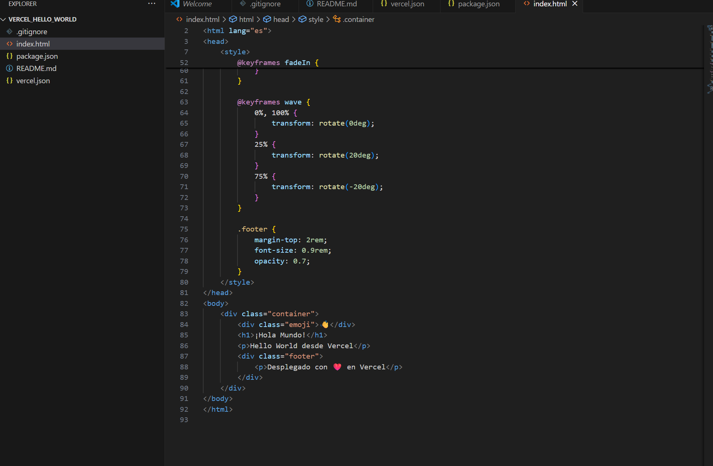
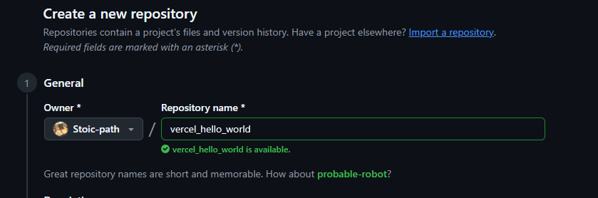
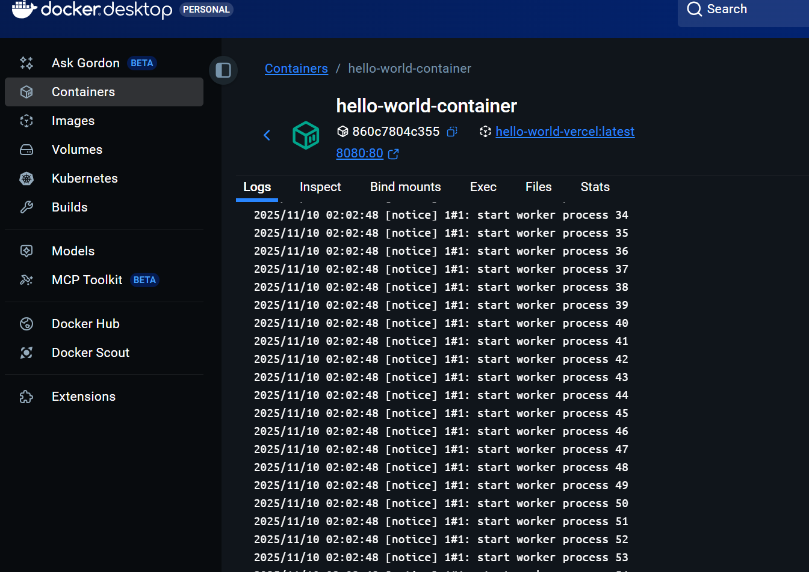
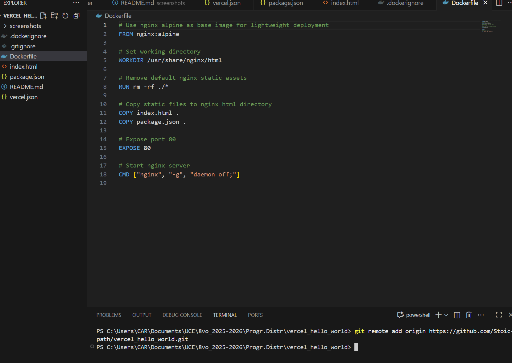
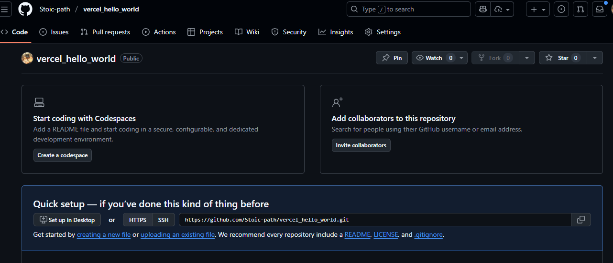
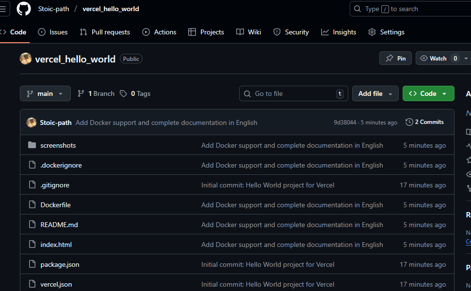
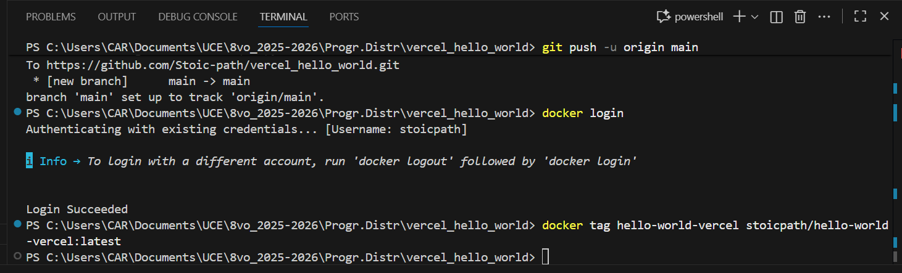

# Hello World - Vercel & Docker Deployment

A simple Hello World application ready for deployment on Vercel and Docker Hub.

[](https://hub.docker.com/r/stoicpath/hello-world-vercel)
[](https://github.com/Stoic-path/vercel_hello_world)
[](https://vercelhelloworld-tau.vercel.app/)

## � Screenshots / Evidence

### 1. Local Development


### 2. Docker Build Process


### 3. Docker Container Running


### 4. Docker Hub Repository


### 5. GitHub Repository


### 6. Vercel Deployment


### 7. Application Running


---

##  Table of Contents

- [Screenshots / Evidence](#screenshots--evidence)
- [Overview](#overview)
- [Prerequisites](#prerequisites)
- [Project Structure](#project-structure)
- [Deployment Options](#deployment-options)
  - [Option 1: Using Docker Hub](#option-1-using-docker-hub)
  - [Option 2: From GitHub Repository](#option-2-from-github-repository)
  - [Option 3: Vercel Live Deployment](#option-3-vercel-live-deployment)
- [Technologies Used](#technologies-used)

## 🔍 Overview

This is a lightweight Hello World application featuring:
- Simple and clean HTML structure
- Docker containerization with nginx
- Ready for Vercel deployment
- Fully documented code with English comments

## ✅ Prerequisites

Before you begin, ensure you have the following installed:

- [Docker Desktop](https://www.docker.com/products/docker-desktop) installed and running
- [Git](https://git-scm.com/downloads) (only for Option 2)

## 📁 Project Structure

```
vercel_hello_world/
├── Dockerfile          # Docker configuration for containerization
├── package.json        # Node.js project configuration
├── vercel.json         # Vercel deployment configuration
├── README.md           # Project documentation (this file)
├── frontend/           # Frontend application folder
│   └── index.html      # Main HTML page with detailed English comments
├── docs/               # Additional documentation folder
│   ├── package-json-explanation.md    # Explains package.json structure
│   └── vercel-json-explanation.md     # Explains vercel.json structure
└── screenshots/        # Screenshots folder for documentation

```

## 🚀 Deployment Options

### Option 1: Using Docker Hub

**Pull and run the pre-built image directly from Docker Hub (no source code needed):**

```bash
# Pull the image from Docker Hub
docker pull stoicpath/hello-world-vercel:latest

# Run the container
docker run -d -p 8080:80 --name hello-world-container stoicpath/hello-world-vercel:latest
```

**Access the application at:** http://localhost:8080

**To stop and remove:**
```bash
docker stop hello-world-container
docker rm hello-world-container
```

---

### Option 2: From GitHub Repository

**Clone the repository and build from source:**

```bash
# Clone repository
git clone https://github.com/Stoic-path/vercel_hello_world.git
cd vercel_hello_world

# Build Docker image from source
docker build -t hello-world-vercel .

# Run the container
docker run -d -p 8080:80 --name hello-world-container hello-world-vercel
```

**Access the application at:** http://localhost:8080

**To stop and remove:**
```bash
docker stop hello-world-container
docker rm hello-world-container
```

---

### Option 3: Vercel Live Deployment

**Access the live application directly (no installation required):**

🌐 **Live URL:** https://vercelhelloworld-tau.vercel.app/

This deployment is hosted on Vercel's serverless platform and is always available online.

---

## 🛠️ Technologies Used

- **HTML5** - Markup structure with detailed comments
- **Docker** - Containerization
- **Nginx Alpine** - Web server (lightweight)
- **Vercel** - Serverless deployment platform

## 🔗 Useful Links

- **Docker Hub Image**: https://hub.docker.com/r/stoicpath/hello-world-vercel
- **GitHub Repository**: https://github.com/Stoic-path/vercel_hello_world
- **Live Deployment**: https://vercelhelloworld-tau.vercel.app/

## 📄 License

MIT License - feel free to use this project for learning purposes.

## 👤 Author

Created as a demonstration project for distributed programming course.

**Repository**: [github.com/Stoic-path/vercel_hello_world](https://github.com/Stoic-path/vercel_hello_world)  
**Docker Image**: [hub.docker.com/r/stoicpath/hello-world-vercel](https://hub.docker.com/r/stoicpath/hello-world-vercel)

---